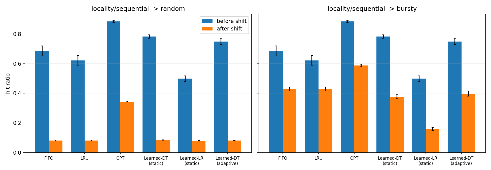
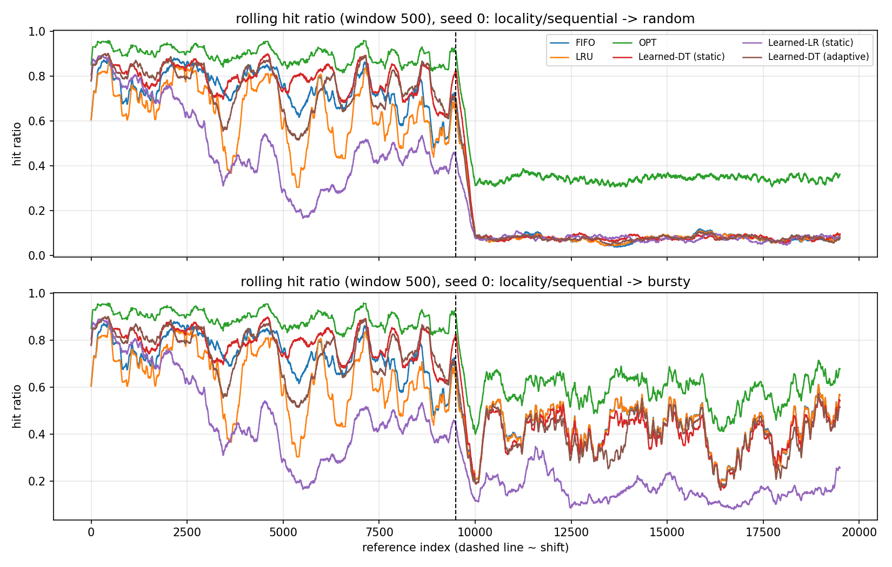

# CSE-307 Term Paper — Track 1: Learned Page Replacement

**Course:** CSE-307 Operating Systems, Section B — *Learning-Augmented OS Heuristics: Classical Algorithms Meet Adaptive Prediction*
**Author:** Farhan Intesar Mugdho ([@farhanmugdho](https://github.com/farhanmugdho))

Classical page replacement (FIFO, LRU, Belady's Optimal) is compared against a small learned eviction policy
(decision tree / logistic regression) on a synthetic trace whose access pattern **shifts halfway through**.

## What is implemented

| Part | File |
|---|---|
| FIFO, LRU, Optimal (Belady) + simulator | `lpr/policies.py` |
| Per-page features (recency, age, frequency, decayed frequency, last reuse gap) | `lpr/features.py` |
| Learned eviction policy (static DT, static LR, adaptive DT that retrains online) | `lpr/learned.py` |
| Workload generator with a mid-trace shift | `lpr/workloads.py` |
| Experiment runner, tables and charts | `run_experiments.py` |
| Correctness tests (textbook reference string: FIFO 15, LRU 12, OPT 9 faults) | `tests/test_policies.py` |

### Learned component
* At each eviction, every resident page is described by 5 features. A classifier predicts whether the page is among the
  farthest-reused 25% of candidates (hindsight label from Belady-style next-use distance); the page with the highest
  predicted probability is evicted (ties broken toward LRU).
* **Static** models are trained offline on a *pre-shift-style* trace only (different seed from the evaluation trace),
  using data collected under random eviction for good state coverage.
* **Adaptive** model starts from the static decision tree and is retrained every 1000 references on the most recent
  3000 references (past data only, no look-ahead).

### Workload
* First half (10,000 refs): locality-heavy + sequential — a drifting 40-page working set, alternately scanned in loops
  and accessed with Zipf skew.
* Second half (10,000 refs): either **random** (uniform over 400 pages) or **bursty** (random background plus short
  bursts on an 8-page group).
* 32 frames, 5 seeds.

## Setup & run

```bash
python -m venv .venv && source .venv/bin/activate   # optional
pip install -r requirements.txt
python -m pytest -q tests          # classical algorithms check
python run_experiments.py          # ~1-2 min; writes to results/
python run_experiments.py --seeds 10 --frames 48   # other options: --length --train-length --out
```

Outputs in `results/`: `summary.md`, `summary.csv`, `raw_results.csv`, `hit_ratio_before_after.png`, `rolling_hit_ratio.png`.

## Results (mean over 5 seeds, std in parentheses)


### Scenario: locality/sequential -> random

| Policy | Hit ratio before | Hit ratio after | Drop | Faults before | Faults after | Gap to OPT before | Gap to OPT after |
|---|---|---|---|---|---|---|---|
| FIFO | 0.687 (0.034) | 0.081 (0.003) | 0.606 (0.037) | 3133 (345) | 9189 (34) | 0.198 (0.029) | 0.263 (0.002) |
| LRU | 0.622 (0.033) | 0.081 (0.004) | 0.541 (0.035) | 3775 (334) | 9190 (36) | 0.263 (0.029) | 0.263 (0.002) |
| OPT | 0.885 (0.006) | 0.344 (0.002) | 0.541 (0.007) | 1149 (56) | 6562 (22) | 0.000 (0.000) | 0.000 (0.000) |
| Learned-DT (static) | 0.784 (0.012) | 0.082 (0.004) | 0.702 (0.012) | 2158 (118) | 9176 (36) | 0.101 (0.008) | 0.261 (0.004) |
| Learned-LR (static) | 0.499 (0.019) | 0.079 (0.001) | 0.420 (0.018) | 5012 (186) | 9213 (14) | 0.386 (0.019) | 0.265 (0.001) |
| Learned-DT (adaptive) | 0.750 (0.021) | 0.081 (0.002) | 0.670 (0.021) | 2499 (212) | 9194 (21) | 0.135 (0.018) | 0.263 (0.002) |

### Scenario: locality/sequential -> bursty

| Policy | Hit ratio before | Hit ratio after | Drop | Faults before | Faults after | Gap to OPT before | Gap to OPT after |
|---|---|---|---|---|---|---|---|
| FIFO | 0.687 (0.034) | 0.430 (0.013) | 0.257 (0.034) | 3133 (345) | 5700 (133) | 0.198 (0.029) | 0.158 (0.005) |
| LRU | 0.622 (0.033) | 0.430 (0.014) | 0.193 (0.032) | 3775 (334) | 5700 (135) | 0.263 (0.029) | 0.158 (0.005) |
| OPT | 0.885 (0.006) | 0.588 (0.009) | 0.297 (0.009) | 1149 (56) | 4120 (89) | 0.000 (0.000) | 0.000 (0.000) |
| Learned-DT (static) | 0.784 (0.012) | 0.377 (0.014) | 0.407 (0.016) | 2158 (118) | 6232 (139) | 0.101 (0.008) | 0.211 (0.019) |
| Learned-LR (static) | 0.499 (0.019) | 0.158 (0.010) | 0.340 (0.012) | 5012 (186) | 8416 (103) | 0.386 (0.019) | 0.430 (0.016) |
| Learned-DT (adaptive) | 0.750 (0.021) | 0.398 (0.018) | 0.352 (0.010) | 2499 (212) | 6023 (176) | 0.135 (0.018) | 0.190 (0.010) |




## Analysis

> **TODO (author):** the brief requires the analysis to be your own. Write your discussion of which policy degrades
> the most after the shift and *why*, using the tables/charts above (see `report/` notes for questions to consider).

